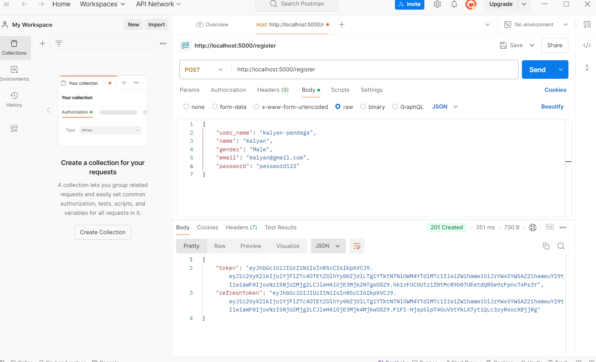
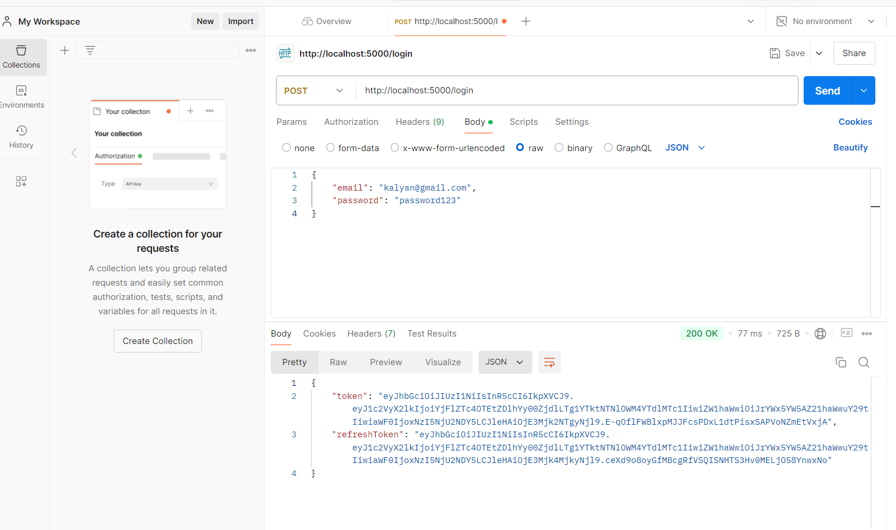
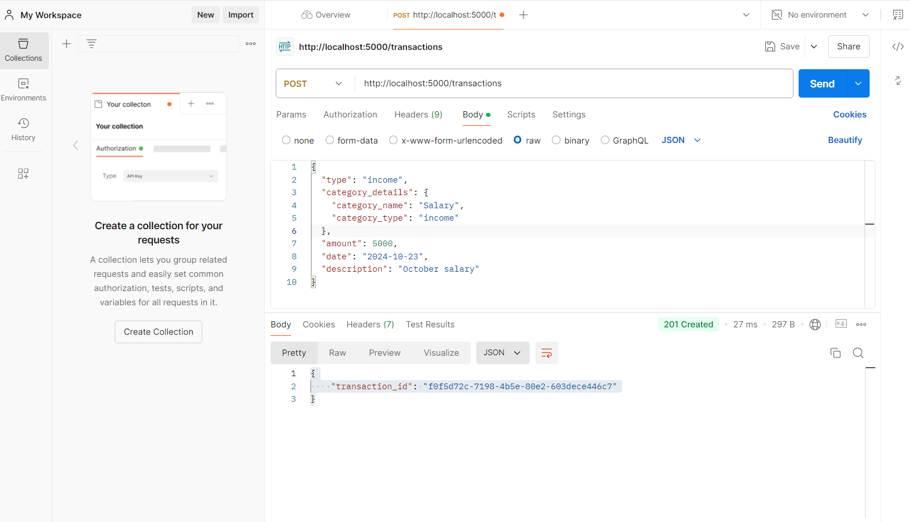
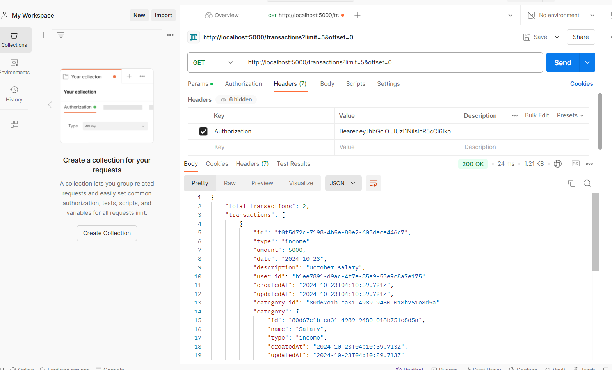
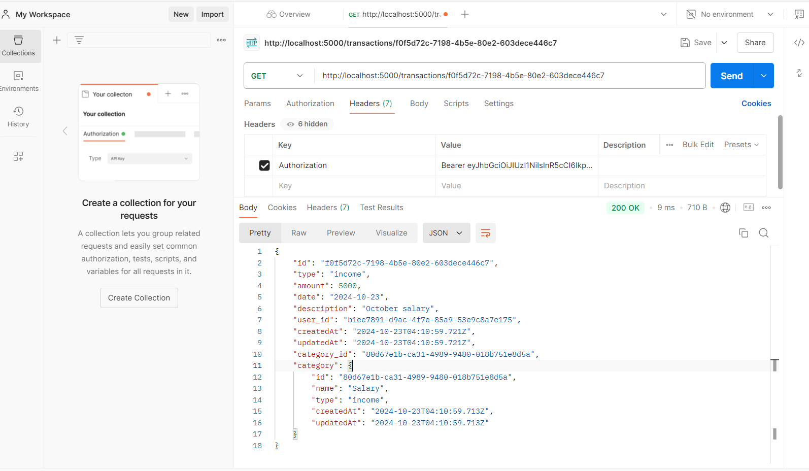
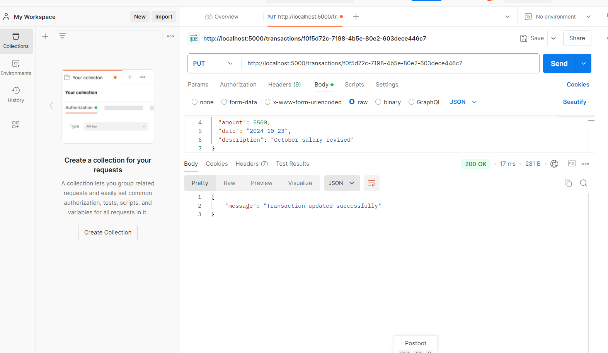
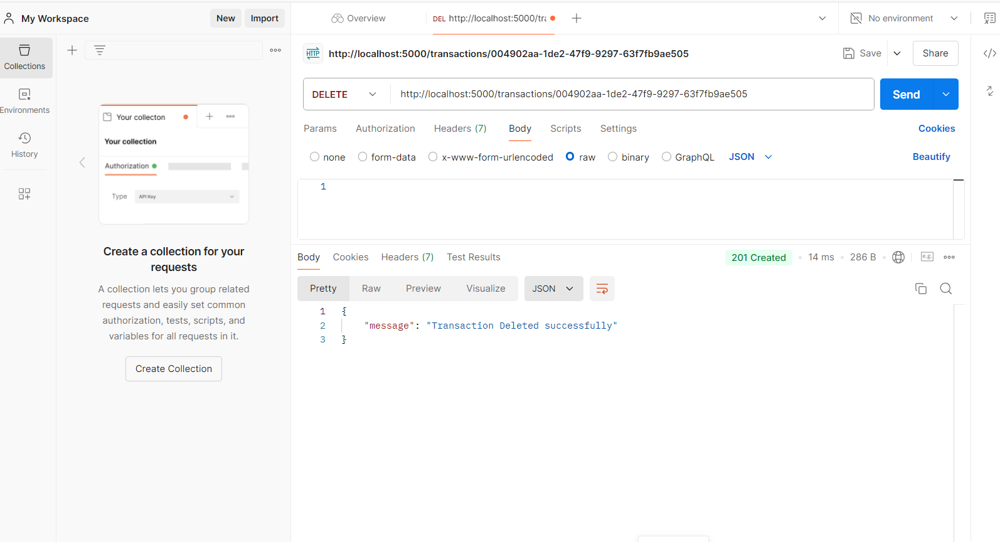
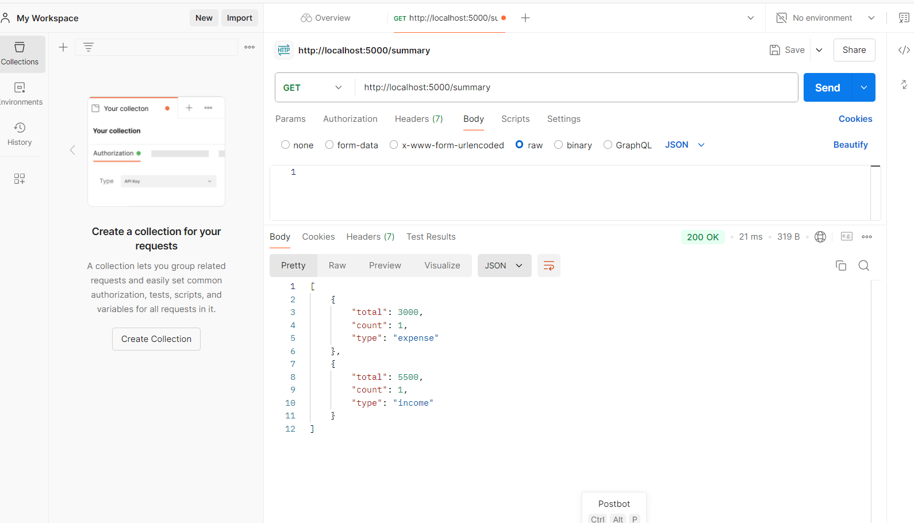

# Personal Expense Tracker Backend

This project is a **Personal Expense Tracker** backend built using Node.js, Express, Sequelize, and SQLite. It provides RESTful API endpoints to manage financial transactions (income/expense), and includes user authentication using JWT tokens. The API supports creating, updating, retrieving, and deleting transactions, as well as generating transaction summaries.

---

## Table of Contents

1. [Features](#features)
2. [Setup Instructions](#setup-instructions)
3. [Run Instructions](#run-instructions)
4. [API Documentation](#api-documentation)
    - [Authentication API](#authentication-api)
    - [Transaction API](#transaction-api)
    - [Summary API](#summary-api)
---

## Features

- JWT-based user authentication.
- Manage financial transactions (income and expense).
- Create, update, delete, and retrieve transactions.
- Generate a summary of transactions, filtered by user.
- Pagination support for retrieving transaction history.

---

## Setup Instructions

### 1. Clone the Repository

```bash
git clone https://github.com/yourusername/expense-tracker.git
cd expense-tracker
```

### 2. Install Dependencies
```bash
npm install
```

### 3. Create a .env file
```bash
touch .env
```
 Add the following environment variables in the .env file:

```bash
PORT=5000
ACCESS_TOKEN_SECRET=your_access_token_secret
REFRESH_TOKEN_SECRET=your_refresh_token_secret
```

### 4. Initialize Database
Ensure SQLite is installed, and Sequelize is correctly configured in your project.

```bash
npx sequelize-cli db:migrate
```

### 5. Start the Server
```bash
npm start
```

The server will be running on http://localhost:5000.


## Run Instructions
To run the project:

Ensure all environment variables are properly configured in .env.
Use npm start to start the server.


## API Documentation

### Authentication API

1. **Register a New User**
   - **Endpoint**: `POST /register`
   - **Description**: Registers a new user with `username`, `name`, `email`, and `password`.
   - **Request Payload**:
     ```json
     {
       "user_name": "john_doe",
       "name": "John Doe",
       "email": "johndoe@example.com",
       "password": "password123"
     }
     ```
   - **Response**:
      ```json
     {
       "accessToken": "your_access_token",
       "refreshToken": "your_refresh_token"
     }
     ```

  

2. **Login**
   - **Endpoint**: `POST /login`
   - **Description**: Authenticates a user and returns an access token and refresh token.
   - **Request Payload**:
     ```json
     {
       "email": "johndoe@example.com",
       "password": "password123"
     }
     ```
   - **Response**:
     ```json
     {
       "accessToken": "your_access_token",
       "refreshToken": "your_refresh_token"
     }
     ```
  
  

### Transaction API

1. **Create a Transaction**
   - **Endpoint**: `POST /transactions`
   - **Description**: Adds a new income or expense transaction.
   - **Headers**: 
     ```plaintext
     Authorization: Bearer {accessToken}
     ```
   - **Request Payload**:
     ```json
     {
       "type": "income",
       "category_details": {
         "category_name": "Salary",
         "category_type": "income"
       },
       "amount": 3000,
       "date": "2024-10-10",
       "description": "October Salary"
     }
     ```
   - **Response**:
     ```json
     {
       "transaction_id": "uuid-of-transaction"
     }
     ```
  

2. **Get All Transactions**
   - **Endpoint**: `GET /transactions`
   - **Description**: Retrieves all transactions for the logged-in user, supports pagination.
   - **Headers**:
     ```plaintext
     Authorization: Bearer {accessToken}
     ```
   - **Query Parameters**:
     - `limit`: Number of transactions to return.
     - `offset`: Number of transactions to skip.
   - **Response**:
     ```json
     {
       "transactions": [
         {
           "id": "uuid-of-transaction",
           "type": "income",
           "category": {
             "category_name": "Salary",
             "category_type": "income"
           },
           "amount": 3000,
           "date": "2024-10-10",
           "description": "October Salary"
         }
       ],
       "total": 1
     }
     ```
  

3. **Get a Transaction by ID**
   - **Endpoint**: `GET /transactions/:id`
   - **Description**: Retrieves a specific transaction by ID.
   - **Headers**:
     ```plaintext
     Authorization: Bearer {accessToken}
     ```
   - **Response**:
     ```json
     {
       "id": "uuid-of-transaction",
       "type": "income",
       "category": {
         "category_name": "Salary",
         "category_type": "income"
       },
       "amount": 3000,
       "date": "2024-10-10",
       "description": "October Salary"
     }
     ```
  
  

4. **Update a Transaction**
   - **Endpoint**: `PUT /transactions/:id`
   - **Description**: Updates an existing transaction.
   - **Headers**:
     ```plaintext
     Authorization: Bearer {accessToken}
     ```
   - **Request Payload**:
     ```json
     {
       "type": "expense",
       "category_id": "uuid-of-new-category",
       "amount": 2000,
       "date": "2024-10-15",
       "description": "New expense"
     }
     ```
   - **Response**:
     ```json
     {
       "message": "Transaction updated successfully"
     }
     ```

  

5. **Delete a Transaction**
   - **Endpoint**: `DELETE /transactions/:id`
   - **Description**: Deletes a transaction by ID.
   - **Headers**:
     ```plaintext
     Authorization: Bearer {accessToken}
     ```
   - **Response**:
     ```json
     {
       "message": "Transaction deleted successfully"
     }
     ```

     

---

### Summary API

1. **Get Summary**
   - **Endpoint**: `GET /summary`
   - **Description**: Retrieves a summary of the user's transactions, showing total income, total expenses, and the balance.
   - **Headers**:
     ```plaintext
     Authorization: Bearer {accessToken}
     ```
   - **Response**:
     ```json
     [
       {
         "total": 5000,
         "count": 2,
         "type": "income"
       },
       {
         "total": 2000,
         "count": 1,
         "type": "expense"
       }
     ]
     ```

  


